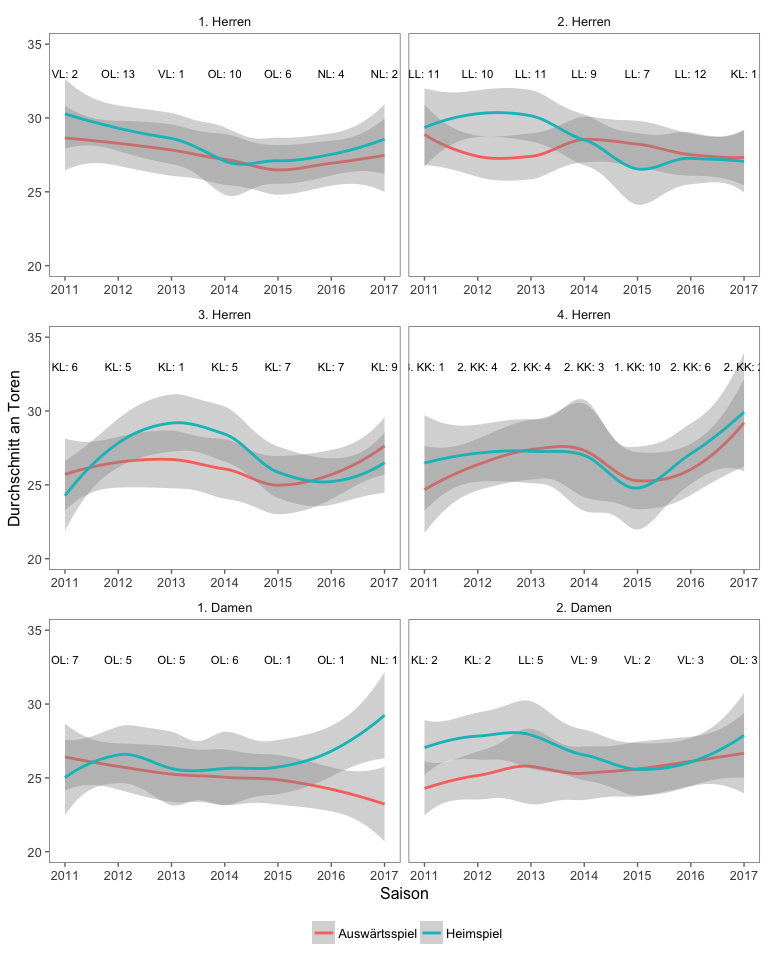
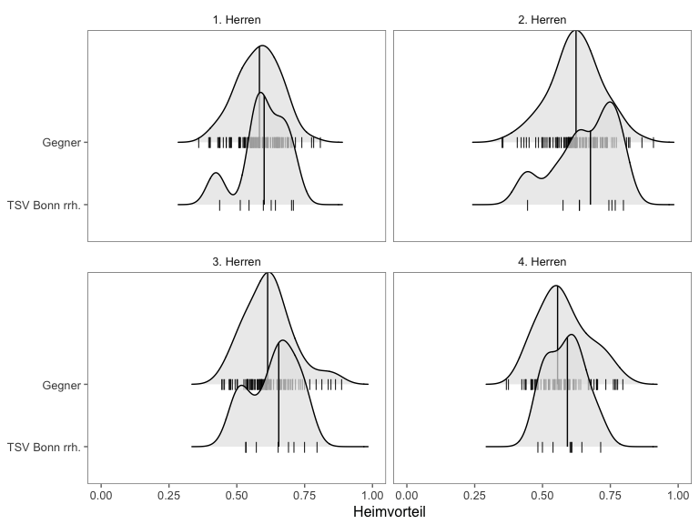
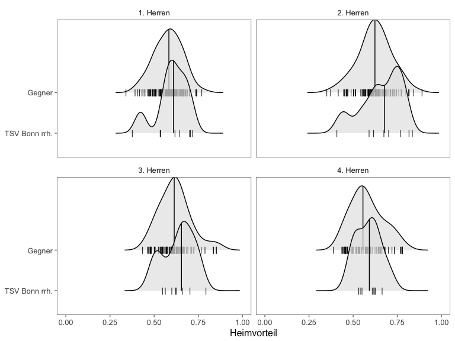
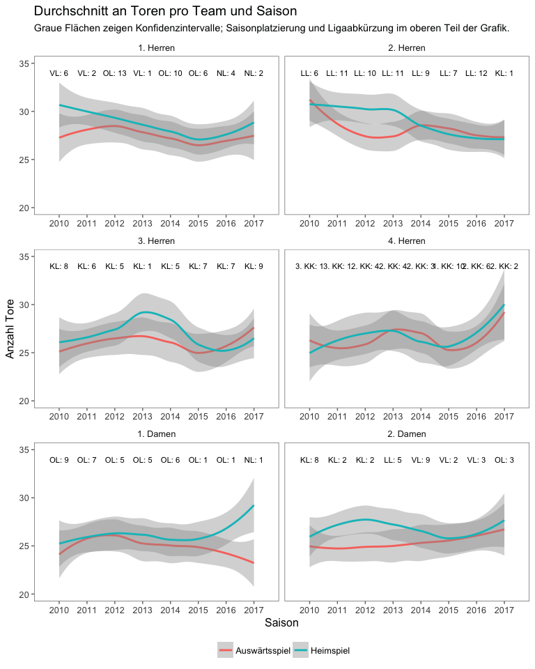
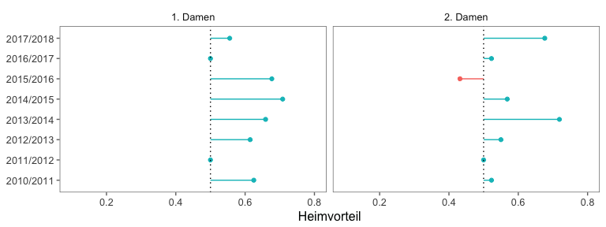
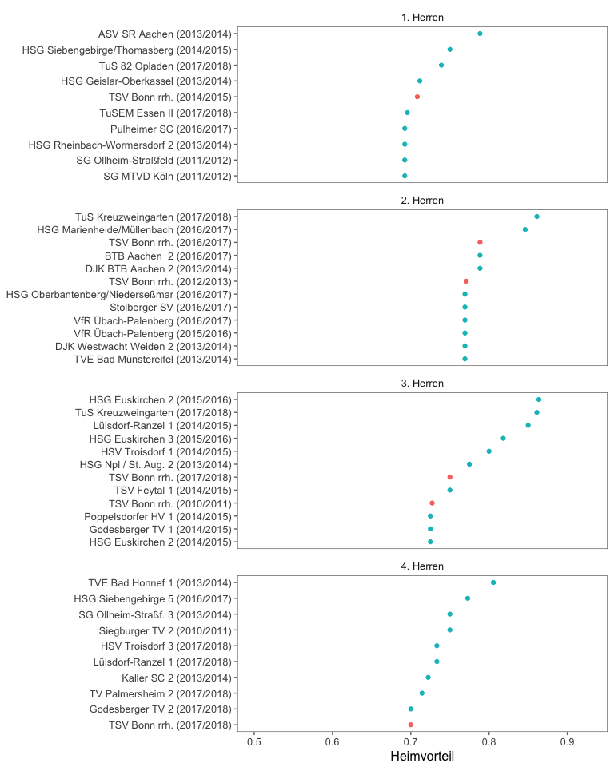
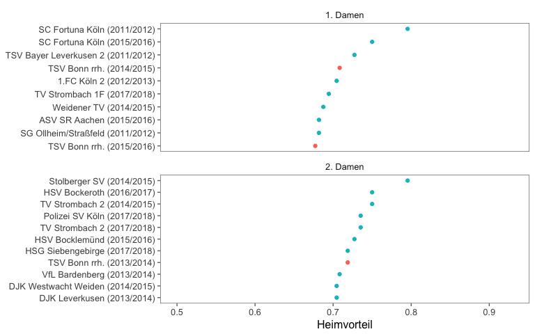

Mythos Ringarena
================
Stefan Müller

Die Ringarena, Heimspielstätte der [TSV Bonn rrh.](http://tsv-bonn.de) ist berühmt berüchtigt, sowohl bei den Beueler Handballern als auch bei den Gegnern. Die Beueler schätzen die Halle dank des Räumchens, Gegner fürchten den "Schuhkarton" vor allem aufgrund der Enge und des kleinen Spielfelds.

Liest man Vorberichte der Gegner zu Auswärtsspielen bei der TSV, kommt die Halle an der Ringstraße häufig zur Sprache, eben weil sie so besonders ist. Doch ist die Ringarena tatsächlich ein Vorteil für die Beueler Handballerinnen und Handballer?

Um das herauszufinden (und um meine Kenntnisse mit dem [**rvest**](https://github.com/hadley/rvest) R package zu verbessern, mit dem man Tabellen von Websiten scrapen kann), habe ich alle Saisonspiele aller Seniorenmannschaften, seit der Saison 2010/2011 von [SIS-Handball](http://sis-handball.de) gescraped. Der gesamte Code und die Daten sind [hier verfügbar](https://github.com/stefan-mueller/ringarena). Da die Websites für alle Ligen und Jahre gleich aufgebaut sind, reichen ca. 20 Zeilen Code (und eine Liste mit den Weblinks für jede Liga und Jahr), um einen Datensatz mit allen Spielen aus den Ligen zu erstellen, in denen ein TSV-Seniorenteam vertreten war. Der Datensatz umfasst insgesamt 6420 Spiele.

Mit diesem Datensatz lässt sich nun der "Heimvorteil" berechnen (siehe u.a. [Pollard et al. 2017](https://www.tandfonline.com/doi/abs/10.1080/24748668.2017.1372164)). Grob gesprochen kann der Wert für jedes Team in der Saison zwischen 0 und 1 liegen. Ein Wert von 1 bedeutet, dass alle Punkte daheim eingefahren wurde, eine 0 impliziert, dass ein Team Punkte lediglich auswärts errungen hat. Folglich markieren alle Werte über 0.5 einen Heimvorteil: das Team hat mehr Heim- als Auswärtspunkte gesammelt.

Schauen wir zunächst, ob es überhaupt einen Heimvorteil gibt. Hierfür plotte ich die Verteilung der Werte aller Teams (aufgesplittet nach TSV-Teams und Gegnern). Jeder Punkt zeigt eine Saison eines Teams. Der Median (roter horizontaler Balken) liegt in beiden Gruppen bei etwa 0.6. Es gibt auf HVM- und Kreisebene eindeutig einen Heimvorteil.

Als nächstes schauen wir uns das Ganze pro TSV-Team an. Die kurzen schwarzen Balken auf der X-Achse markieren die Observationen (Werte pro Saison), die Kurve ist eine simple Häufigkeitsverteilung, der lange vertikale Balken markiert den Median. Bei den Herren sind vor allem die Zweit-, Dritt- und Viertvertretung merklich stärker in der Ringarena als in fremden Hallen. Bei der "Ersten" ist der Unterschied deutlich geringer. Die dritte Damenmannschaft wurde übrigens ausgeschlossen, weil sie nicht seit 2010 besteht.

Die zweite Damenmannschaft ist das einzige Team mit einem niedrigeren Medianwert für die Heimvorteilsskala als der Gegner.

Nun schauen wir auf den Heimvorteil pro Saison und Team. Grüne Balken zeigen, dass mehr Punkte in der Ringarena als in fremden Hallen gesammelt wurden. Bis auf drei Saisons (1. und 2. Herren in 2010/2011 und 2. Damen 2015/2016) haben alle TSV-Seniorenteams mehr Punkte in der Ringarena als auswärts geholt.

Abschließend die besten Heimteams des ganzen Datensatzes. Die Daten werden für jedes Team gruppiert und die 10 Beobachtungen mit den höchsten Heimvorteilswerten gefiltert. Alle Mannschaften (!) befinden sich mindestens einmal unter den Top 10 verglichen mit den Werten der Gegner seit 2010. Der Ruf der Ringarena scheint tatsächlich berechtigt!

