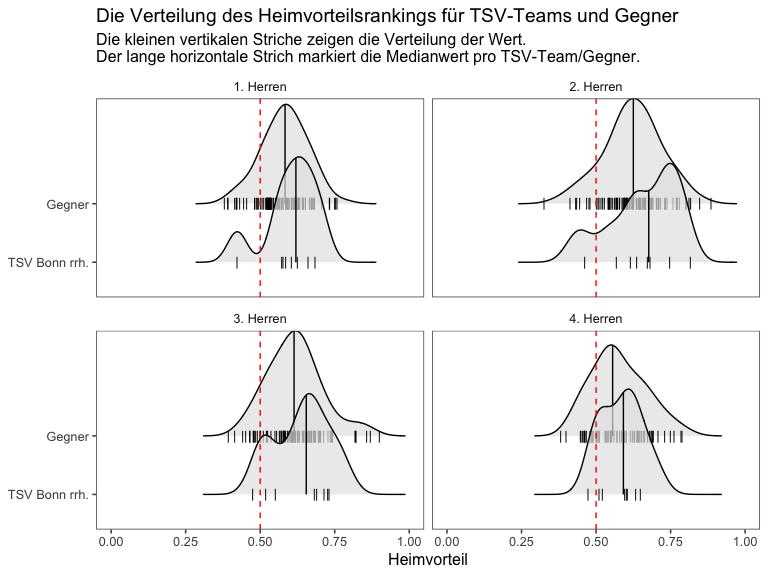
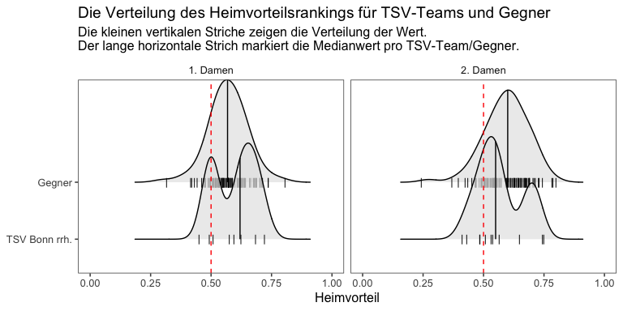
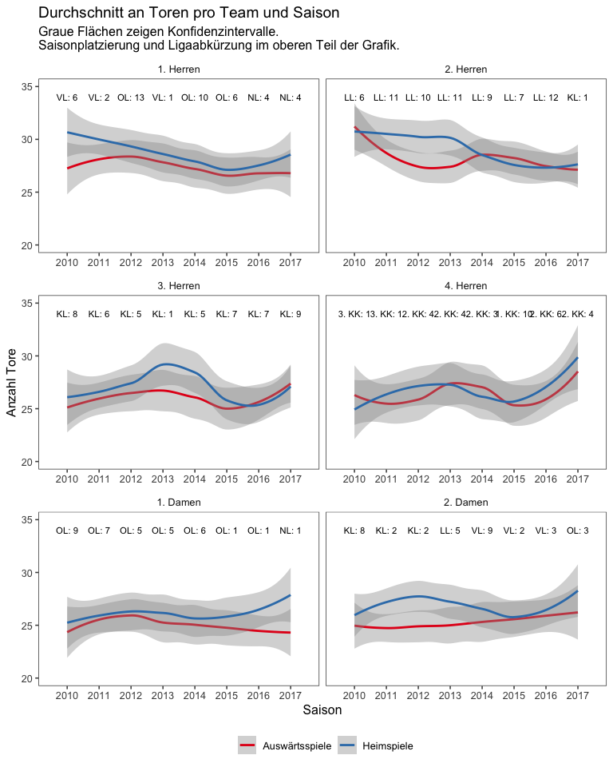
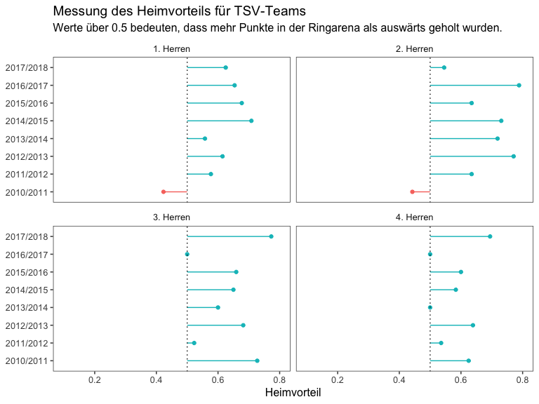
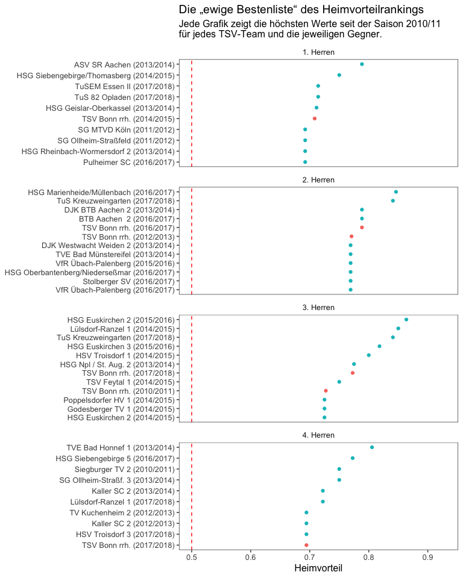
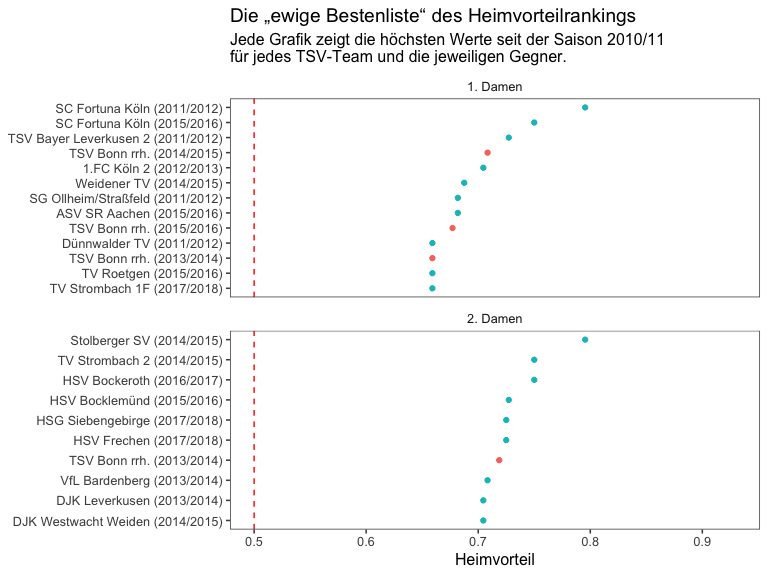

Mythos Ringarena
================
Stefan Müller

Die Ringarena, Heimspielstätte der [TSV Bonn rrh.](http://tsv-bonn.de) (mein geliebter Heimatverein), ist berühmt berüchtigt - sowohl bei den Beueler Handballern als auch bei den Gegnern. Die TSV'ler schätzen die Halle unter anderem wegen der Geselligkeit und Kaltgetränke im Räumchen, Auswärtsteams fürchten den "Schuhkarton" aufgrund der Enge und des kleinen Spielfelds.

Liest man Vorberichte der Gegner zu Auswärtsspielen bei der TSV, kommt die Halle an der Ringstraße häufig zur Sprache, eben weil sie so besonders ist. Doch birgt die Ringarena tatsächlich ein Vorteil für die Beueler Handballerinnen und Handballer?

Um das herauszufinden, habe ich alle Saisonspiele aller Seniorenmannschaften zwischen der Saison 2010/2011 und 2017/2018 von [SIS-Handball](http://sis-handball.de) automatisch gescraped. Der gesamte Code und die Daten sind [hier verfügbar](https://github.com/stefan-mueller/ringarena). Der Datensatz umfasst insgesamt 6.420 Spiele.

Mit diesem Datensatz lässt sich nun der "Heimvorteil" berechnen (genauer beschrieben in einem [Paper von Liam Kneafsey und mir](https://muellerstefan.net/papers/ijpas_kneafsey_mueller.pdf), das bald im *International Journal of Performance Analysis in Sport* veröffentlicht wird). Grob gesprochen kann der Wert für jedes Team in der Saison zwischen 0 und 1 liegen. Ein Wert von 1 bedeutet, dass alle Punkte daheim eingefahren wurde, eine 0 impliziert, dass ein Team Punkte lediglich Auswärts errungen hat. Folglich markieren alle Werte über 0.5 einen Heimvorteil: das Team hat mehr Heim- als Auswärtspunkte gesammelt.

Schauen wir zunächst, ob es überhaupt einen Heimvorteil gibt. Hierfür plotte ich die Verteilung der Werte aller Teams (aufgesplittet nach TSV-Teams und Gegnern). Jeder Punkt zeigt eine Saison eines Teams. Der Median (roter horizontaler Balken) liegt in beiden Gruppen bei etwa 0.6. Ein Wert von 0.6 bedeutet, dass ein Team 60 Prozent der Punkte in einer Saison zuhause holt. Es gibt in der Nordrheinliga, der HVM-Ebene und auf Kreisebene eindeutig einen Heimvorteil.

Als nächstes schauen wir uns das Ganze pro TSV-Team an. Die kurzen schwarzen Balken auf der x-Achse markieren die Observationen (Werte des Heimvorteilsranking pro Saison), die Kurve ist eine Häufigkeitsverteilung, der lange vertikale Balken markiert den Median. Bei den Herren sind vor allem die Zweit-, Dritt- und Viertvertretung merklich stärker in der Ringarena als in fremden Hallen. Bei der "Ersten" ist der Unterschied deutlich geringer.

Die zweite Damenmannschaft ist das einzige Team mit einem niedrigeren Medianwert für die Heimvorteilsskala als alle Gegner seit 2010.

Der Datensatz erlaubt es, Änderungen im Zeitverlauf anzuschauen. Der folgende Plot zeigt die Anzahl an geworfenen TSV-Toren in Heim-und Auswärtsspielen pro Saison und Team. Oben befindet sich die Liga und Abschlussplatzierung. Fast immer liegt die blaue Linie über der roten - es wurden also mehr Tore im Durchschnitt in der Ringarena als Auswärts geworfen. Ausnahmen bildet die 2. Herren 2015/16, die Dritte in der vergangenen Saison und die 4. Herren 2010/2011. Einige interessante Beobachtunge. Seit der Saison 2015/16 hat die Anzahl an Toren bei der 1. Herren zugenommen bei der 2. Herren sehen wir einen negativen Trend im Zeitverlauf. Die "Dritte" hat einen klaren positiven Ausreißer im Jahr 2013/14, als die Kreismeisterschaft errungen wurde. Der Trend der Vierten Herren zeigt seit 2015 deutlich nach oben. Verjüngung des Kaders, x-ter Frühling der Oldies oder Mischung aus beidem? Außerdem wird die Heimdominanz der 1. Damen in den vergangenen zwei Spielzeiten sehr deutlich.

Nun schauen wir auf den Heimvorteil pro Saison und Team. Grüne Balken zeigen, dass mehr Punkte in der Ringarena als in fremden Hallen gesammelt wurden. Bis auf drei Saisons (1. und 2. Herren in 2010/2011 und 2. Damen 2015/2016) haben alle TSV-Seniorenteams mehr Punkte in der Ringarena als Auswärts geholt.

Abschließend ein Blick auf die besten Heimteams des ganzen Datensatzes. Die Daten werden für jedes Team gruppiert und die 10 Beobachtungen mit den höchsten Heimvorteilswerten gefiltert. Alle TSV-Mannschaften (!) befinden sich mindestens einmal unter den Top 10 verglichen mit den Werten der Gegner seit 2010. Der Ruf der Ringarena scheint tatsächlich berechtigt!

